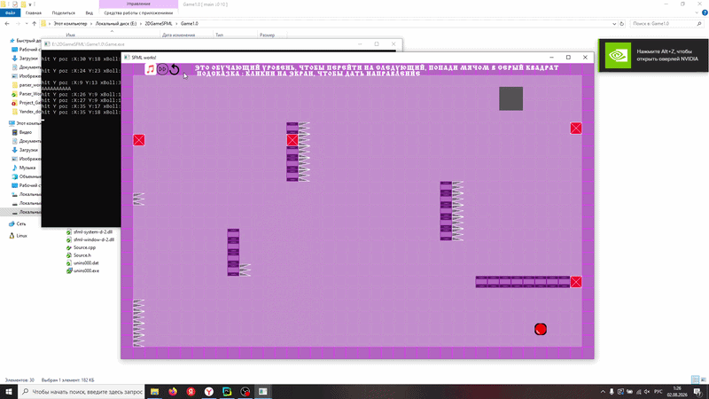

# 2DGameSFML

[](https://github.com/M1shut3r/2DGameSFML/actions/workflows/ci.yml)
[](https://github.com/M1shut3r/2DGameSFML/releases/latest)
[](LICENSE)
[](https://github.com/M1shut3r/2DGameSFML/releases/latest)

A 2D puzzle game built with [SFML](https://www.sfml-dev.org/). Click to launch the ball, bounce off walls, and reach the goal before time runs out.

You do **not** need Visual Studio to play. Download a ready build from [Releases](https://github.com/M1shut3r/2DGameSFML/releases/latest).



## Download

| Platform | File |
| --- | --- |
| Windows 10/11 x64 | [`2DGameSFML-windows-x64.zip`](https://github.com/M1shut3r/2DGameSFML/releases/latest/download/2DGameSFML-windows-x64.zip) |
| Linux x86_64 | [`2DGameSFML-linux-x86_64.tar.gz`](https://github.com/M1shut3r/2DGameSFML/releases/latest/download/2DGameSFML-linux-x86_64.tar.gz) |
| Linux AppImage | [`2DGameSFML-linux-x86_64.AppImage`](https://github.com/M1shut3r/2DGameSFML/releases/latest/download/2DGameSFML-linux-x86_64.AppImage) |

**Windows:** extract the zip and run `2DGameSFML.exe`. SFML and the Visual C++ runtime DLLs are included.

**Linux (AppImage):**

```bash
chmod +x 2DGameSFML-linux-x86_64.AppImage
./2DGameSFML-linux-x86_64.AppImage
```

**Linux (tarball):**

```bash
tar -xf 2DGameSFML-linux-x86_64.tar.gz
cd 2DGameSFML-linux-x86_64
./2DGameSFML.sh
```

Pushing a `v*` tag publishes a new GitHub Release automatically.

## How to play

- Left-click the field to set the ball direction
- The gray square is the level exit
- Lasers and traps reset the ball to the start
- Swamp tiles slow the ball; `z` tiles restore speed
- Some levels have a time limit
- Top-left icons: mute, next track, reset ball

Try the built-in maps first. After those, later levels keep generating.

## Build from source

You need **CMake 3.16+**, a **C++17** compiler, and **SFML 2.5+**.

### Linux

```bash
sudo apt-get install cmake g++ libsfml-dev
cmake -S . -B build -DCMAKE_BUILD_TYPE=Release
cmake --build build
./build/2DGameSFML
```

### Windows

1. Install Visual Studio 2022 (C++) and CMake.
2. Download [SFML 2.6.2 VC17 64-bit](https://github.com/SFML/SFML/releases/tag/2.6.2).
3. Build:

```powershell
cmake -S . -B build -A x64 -DCMAKE_PREFIX_PATH="C:\path\to\SFML-2.6.2"
cmake --build build --config Release
```

`Game1.0/Game.vcxproj` still exists for Visual Studio + NuGet. CMake is the supported build.

## Repository layout

```text
2DGameSFML/
├── Game1.0/                 source, maps, and game assets
├── Assets/video.gif         README preview
├── packaging/               desktop file and release archive text
├── scripts/                 Windows zip and Linux tar.gz / AppImage packaging
└── .github/workflows/       CI and GitHub Release publishing
```

## Contributing

Bug reports and pull requests are welcome. See [CONTRIBUTING.md](CONTRIBUTING.md) and the [Code of Conduct](CODE_OF_CONDUCT.md).

## License

The code is released under the [MIT License](LICENSE). Audio and artwork in `Game1.0/` may have separate rights.
